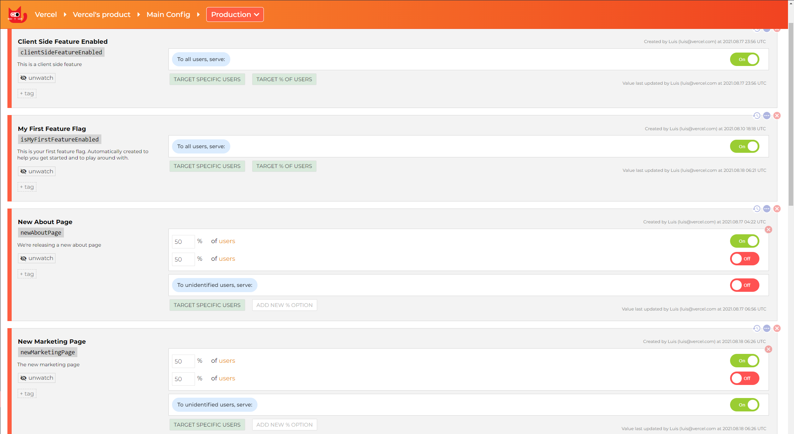

# A/B Testing with ConfigCat

[DataDome](https://datadome.co/) is a service for feature flag and configuration management. In this demo you'll be able to use feature flags at the edge.

## Demo

https://ab-testing-configcat.vercel.app/

### One-Click Deploy

Deploy the example using [Vercel](https://vercel.com?utm_source=github&utm_medium=readme&utm_campaign=customer-success-example):

[](https://vercel.com/new/clone?repository-url=https%3A%2F%2Fgithub.com%2Fvercel-customer-feedback%2Fedge-functions%2Ftree%2Fmain%2Fexamples%2Fconfigcat&env=NEXT_PUBLIC_CONFIGCAT_SDK_KEY&project-name=configcat&repo-name=configcat)

## Getting Started

You'll need to have an account with [ConfigCat](https://app.configcat.com/signup). Once that's done, copy the `.env.example` file in this directory to `.env.local` (which will be ignored by Git):

```bash
cp .env.example .env.local
```

Then open `.env.local` and set the SDK key to match the one in your ConfigCat dashboard. Your key should be right under your feature flags.

The demo uses the following 4 feature flags:



Next, run Next.js in development mode:

```bash
npm install
npm run dev

# or

yarn
yarn dev
```

The `/about` and `/marketing` pages each have a `_middleware.ts` file that takes care of doing the AB testing for each page, using a different feature in ConfigCat.

The index page ([pages/index.tsx](pages/index.tsx)) also shows how to do AB testing under the same path, in SSR and client-side.

We fetch and save the feature flags in JSON at build time to avoid doing any kind of data fetching at the edge, check [scripts/configcat.js](scripts/configcat.js) to see how it works.
